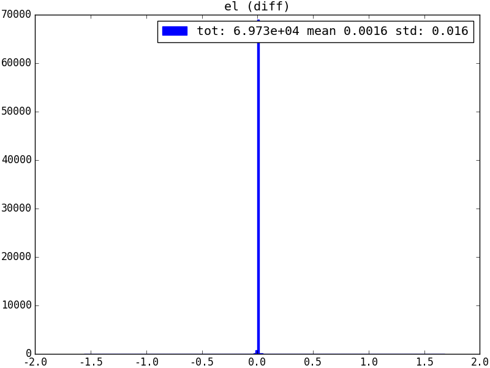
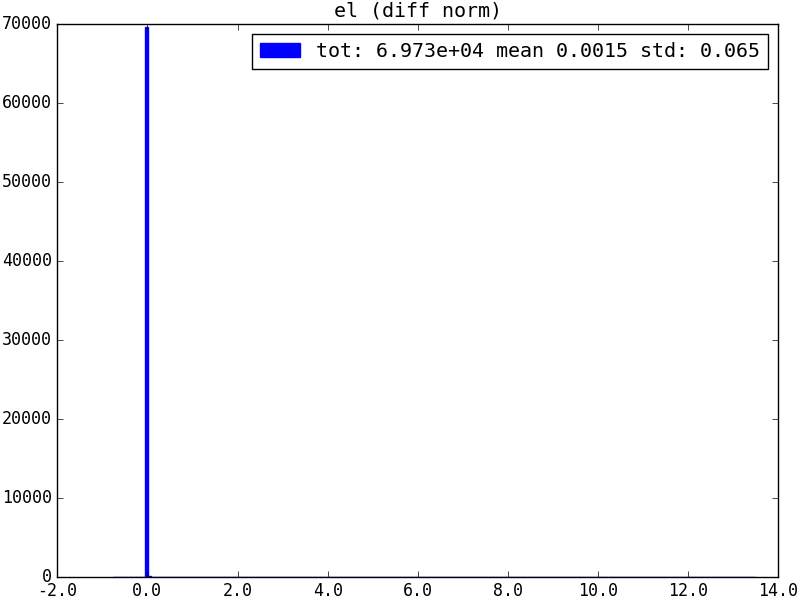
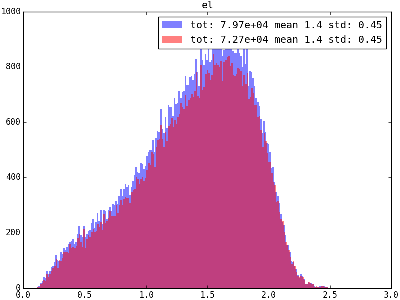
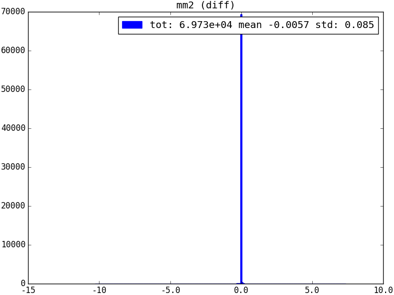
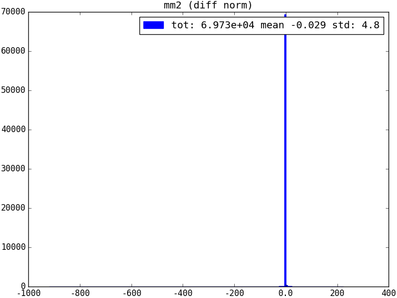
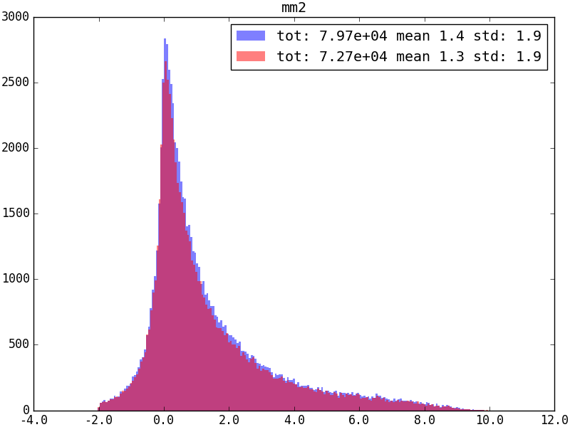

We took Phoebe's $D^*$ step-2 ntuple located at:
```
ntuples/ref-rdx-run1/Dst-mix/Dst--20_07_02--mix--all--2011-2012--md-mu--phoebe.root
```
and extracted the ISO sample as a reference.

Then, we apply most step-2 cuts to our newly generated 2011 MagDown ntuple:
```
ntuples/0.9.2-2011_production/Dst_D0--20_10_12--std--LHCb_Collision11_Beam3500GeV-VeloClosed-MagDown_Real_Data_Reco14_Stripping21r1_90000000_SEMILEPTONIC.DST.root
```
for comparison.

There are ~79k candidates in Phoebe's, ~72k in ours. This is a mystery to be solved.


### `el`
| difference [GeV] | difference (normalized) | distributions [GeV] |
|---|---|---|
|  |  |  |

### `mm2`
| difference [GeV^2^] | difference (normalized) | distributions [GeV^2^] |
|---|---|---|
|  |  |  |
