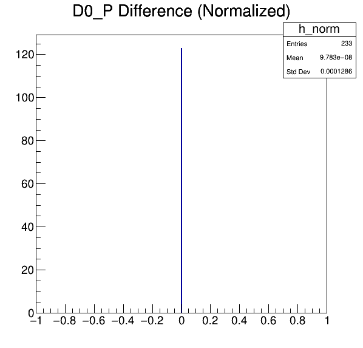

## Generation
* Phoebe used [this DaVinci script](https://github.com/umd-lhcb/lhcb-ntuples-gen/blob/0.1/2012-b2D0MuXB2DMuNuForTauMuLine/ntuple_options-sample.py) to generate her ntuple.
* We based [our script](https://github.com/umd-lhcb/lhcb-ntuples-gen/blob/master/2012-b2D0MuXB2DMuNuForTauMuLine/ntuple_options.py) on Phoebe's.

### Phoebe's `FitDecayTrees`
```python
refitB2Dstmu = FitDecayTrees("refitB2Dstmu", Code = "DECTREE('[B~0 -> (D*(2010)+ -> (D0->K- pi+) pi+) mu- ]CC')", UsePVConstraint = False, Inputs = [SelMyBd.outputLocation()])
refitB2DstmuWS = FitDecayTrees("refitB2DstmuWS", Code = "DECTREE('[B~0 -> (D*(2010)+ -> (D0->K- pi+) pi+) mu+ ]CC')", UsePVConstraint = False, Inputs = [SelMyWSBd.outputLocation()])
refitB2DstmuWS2 = FitDecayTrees("refitB2DstmuWS2", Code = "DECTREE('[B~0 -> (D*(2010)- -> (D0->K- pi+) pi-) mu- ]CC')", UsePVConstraint = False, Inputs = [SelMyWS2Bd.outputLocation()])
YDTFSel = Selection("YDTFSel", Algorithm = refitB2Dstmu, RequiredSelections = [SelMyBd])
YDTFSelWS = Selection("YDTFSelWS", Algorithm = refitB2DstmuWS, RequiredSelections = [SelMyWSBd])
YDTFSelWS2 = Selection("YDTFSelWS2", Algorithm = refitB2DstmuWS2, RequiredSelections = [SelMyWS2Bd])
```

### Ours `FitDecayTrees`
```python
sel_refit_b2DstMu = Selection(
    'SelMyRefitb2DstMu',
    Algorithm=FitDecayTrees(
        'MyRefitb2DstMu',
        Code="DECTREE('[B~0 -> (D*(2010)+ -> (D0->K- pi+) pi+) mu-]CC')",
        UsePVConstraint=False,
        Inputs=[sel_Bd.outputLocation()]
    ),
    RequiredSelections=[sel_Bd]
)

sel_refit_b2DstMu_ws_Mu = Selection(
    'SelMyRefitb2DstMuWSMu',
    Algorithm=FitDecayTrees(
        'MyRefitb2DstMuWSMu',
        Code="DECTREE('[B~0 -> (D*(2010)+ -> (D0->K- pi+) pi+) mu+]CC')",
        UsePVConstraint=False,
        Inputs=[sel_Bd_ws_Mu.outputLocation()]
    ),
    RequiredSelections=[sel_Bd_ws_Mu]
)

sel_refit_b2DstMu_ws_Pi = Selection(
    'SelMyRefitb2DstMuWSPi',
    Algorithm=FitDecayTrees(
        'MyRefitb2DstMuWSPi',
        Code="DECTREE('[B~0 -> (D*(2010)- -> (D0->K- pi+) pi-) mu-]CC')",
        UsePVConstraint=False,
        Inputs=[sel_Bd_ws_Pi.outputLocation()]
    ),
    RequiredSelections=[sel_Bd_ws_Pi]
)
```


## Comparison
Phoebe's ntuple will be used for her upcoming _R(D(*))_ paper. We are using only one of her ntuples. The reference distribution comes from Phoebe's ntuple.

### `D0_P`
| difference [MeV] | difference (%) | reference distribution |
|---|---|---|
|  |  | ? |

### `Dst_2010_minus_P`
| difference [MeV] | difference (%) | reference distribution |
|---|---|---|
|  | !
[Dst_2010_minus_P_diff_norm](Dst_2010_minus_P_diff_norm.png) | ? |

### `Kplus_P`
| difference [MeV] | difference (%) | reference distribution |
|---|---|---|
| (Kplus_P_diff.png) | (Kplus_P_diff_norm.png) | ? |

### `Kplus_PX`
| difference [MeV] | difference (%) | reference distribution |
|---|---|---|
| (Kplus_PX_diff.png) | (Kplus_PX_diff_norm.png) | ? |

### `Kplus_PY`
| difference [MeV] | difference (%) | reference distribution |
|---|---|---|
| (Kplus_PY_diff.png) | (Kplus_PY_diff_norm.png) | ? |

### `Kplus_PZ`
| difference [MeV] | difference (%) | reference distribution |
|---|---|---|
| (Kplus_PZ_diff.png) | (Kplus_PZ_diff_norm.png) | ? |

### `muplus_P`
| difference [MeV] | difference (%) | reference distribution |
|---|---|---|
| (muplus_P_diff.png) | (muplus_P_diff_norm.png) | ? |

### `muplus_PX`
| difference [MeV] | difference (%) | reference distribution |
|---|---|---|
| (muplus_PX_diff.png) | (muplus_PX_diff_norm.png) | ? |

### `muplus_PY`
| difference [MeV] | difference (%) | reference distribution |
|---|---|---|
| (muplus_PY_diff.png) | (muplus_PY_diff_norm.png) | ? |

### `muplus_PZ`
| difference [MeV] | difference (%) | reference distribution |
|---|---|---|
| (muplus_PZ_diff.png) | (muplus_PZ_diff_norm.png) | ? |
