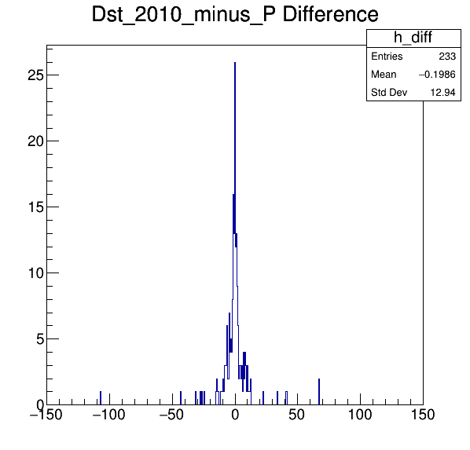
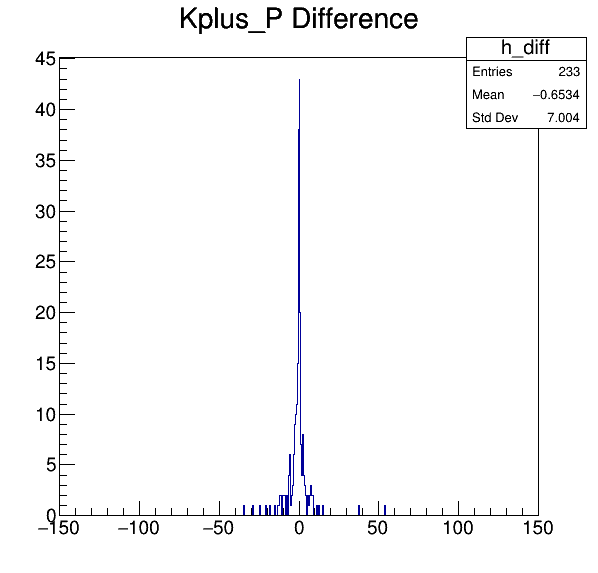
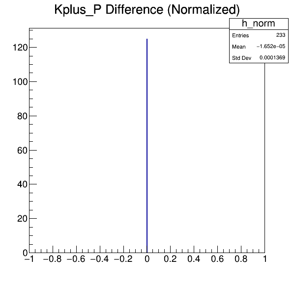
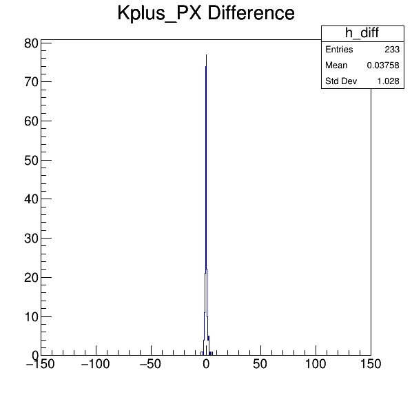
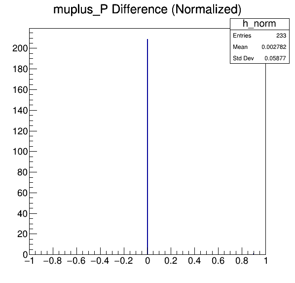
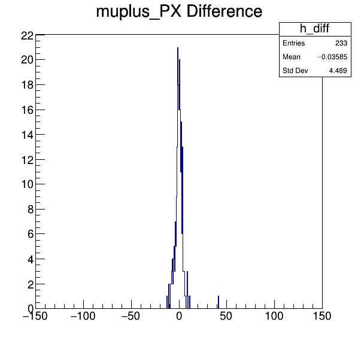
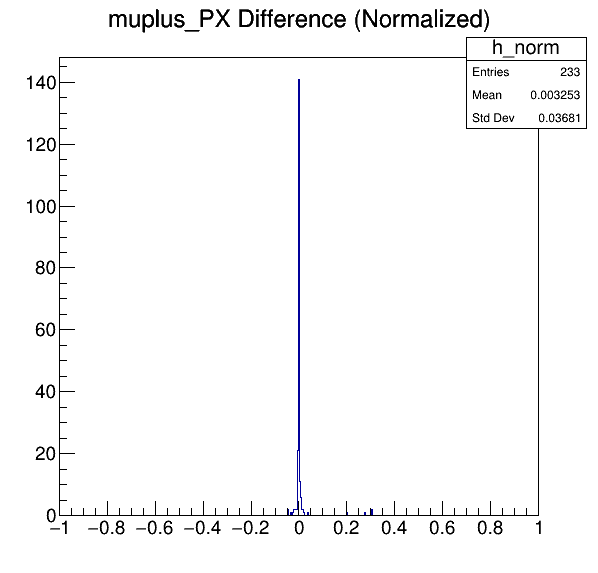
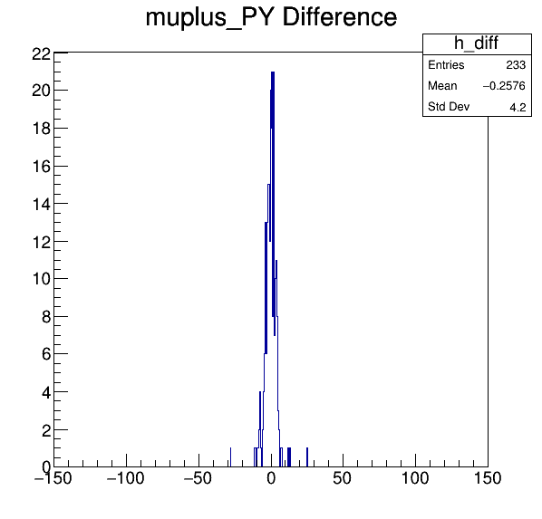

In general, we find the unique events [^1] in both ntuples, then see if they
occur in both ntuples, and find their:

1. absolute difference
2. normalized difference, with one of them used as normalization


[^1]: Typically by the combination of `runNumber` and `eventNumber`.


## Comparison between `YCands_Dstar-2012-mag_down-data` and `YCands`

* Phoebe used [this DaVinci script](https://github.com/umd-lhcb/lhcb-ntuples-gen/blob/0.1/2012-b2D0MuXB2DMuNuForTauMuLine/ntuple_options-sample.py)
  to generate her ntuple, with `DaVinci v36r1p2`. The generated ntuple can be
  found at:
    ```
    <project_root>/2012-b2D0MuXB2DMuNuForTauMuLine/data/sample/YCands_Dstar-2012-mag_down-data.root
    ```

* We used [our script](https://github.com/umd-lhcb/lhcb-ntuples-gen/blob/master/2012-b2D0MuXB2DMuNuForTauMuLine/ntuple_options.py)[^2], and
  `DaVinci v42r8p1`. The ntuple can be found at:

    ```
    <project_root>/2012-b2D0MuXB2DMuNuForTauMuLine/gen/YCands.root
    ```


[^2]: Based on Phoebe's original script.

### `D0_P`
| difference [MeV] | difference (normalized) |
|---|---|
|  |  |

### `Dst_2010_minus_P`
| difference [MeV] | difference (normalized) |
|---|---|
|  |  | ? |

### `Kplus_P`
| difference [MeV] | difference (normalized) |
|---|---|
|  |  |

### `Kplus_PX`
| difference [MeV] | difference (normalized) |
|---|---|
|  |  |

### `Kplus_PY`
| difference [MeV] | difference (normalized) |
|---|---|
|  |  |

### `Kplus_PZ`
| difference [MeV] | difference (normalized) |
|---|---|
|  |  |

### `muplus_P`
| difference [MeV] | difference (normalized) |
|---|---|
|  |  |

### `muplus_PX`
| difference [MeV] | difference (normalized) |
|---|---|
|  |  | ? |

### `muplus_PY`
| difference [MeV] | difference (normalized) |
|---|---|
|  |  | ? |

### `muplus_PZ`
| difference [MeV] | difference (normalized) |
|---|---|
|  |  | ? |
