In general, we find the unique events [^1] in both ntuples, then see if they
occur in both ntuples, and find their:

1. absolute difference
2. normalized difference, with one of them used as normalization


[^1]: Typically by the combination of `runNumber` and `eventNumber`.


## Comparison between 2012 data
The files being compared are:

* `BCands_Dst-data-2012-mag_down-stage2`
* `BCands_Dst-data-2012-mag_down-davinci_v42r8p1-subset`

Additional notes:

* Phoebe used [this DaVinci script](https://github.com/umd-lhcb/lhcb-ntuples-gen/blob/0.1/2012-b2D0MuXB2DMuNuForTauMuLine/ntuple_options-sample.py)
  to generate her ntuple, with `DaVinci v36r1p2`. The generated ntuple can be
  found at:
    ```
    <project_root>/2012-b2D0MuXB2DMuNuForTauMuLine/data/sample/YCands_Dstar-2012-mag_down-data.root
    ```

* We used [our script](https://github.com/umd-lhcb/lhcb-ntuples-gen/blob/master/2012-b2D0MuXB2DMuNuForTauMuLine/ntuple_options.py)[^2], and
  `DaVinci v42r8p1`. The ntuple can be found at:

    ```
    <project_root>/2012-b2D0MuXB2DMuNuForTauMuLine/gen/YCands.root
    ```


[^2]: Based on Phoebe's original script.

### `D0_P`
| difference [MeV] | difference (normalized) |
|---|---|
| 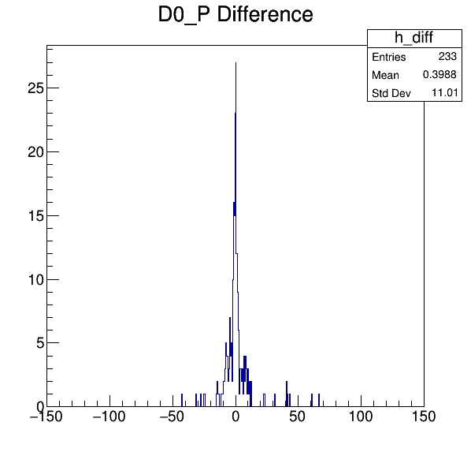 |  |

### `Dst_2010_minus_P`
| difference [MeV] | difference (normalized) |
|---|---|
|  |  |

### `Kplus_P`
| difference [MeV] | difference (normalized) |
|---|---|
|  |  |

### `Kplus_PX`
| difference [MeV] | difference (normalized) |
|---|---|
|  |  |

### `Kplus_PY`
| difference [MeV] | difference (normalized) |
|---|---|
| 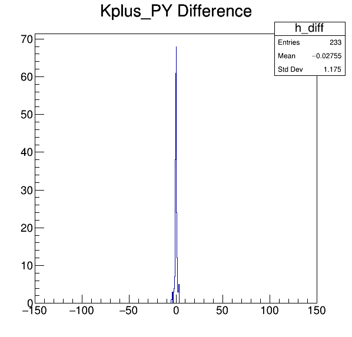 |  |

### `Kplus_PZ`
| difference [MeV] | difference (normalized) |
|---|---|
| 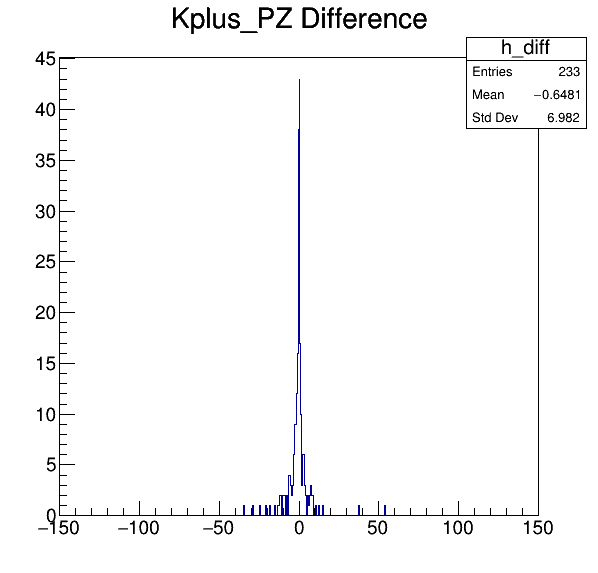 | 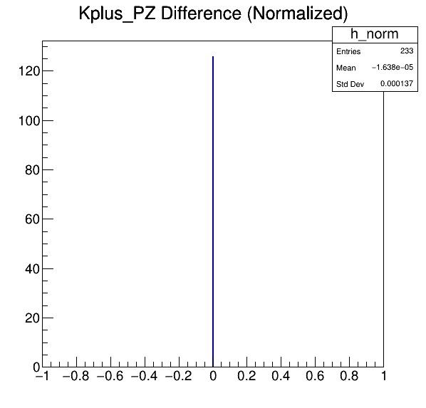 |

### `muplus_P`
| difference [MeV] | difference (normalized) |
|---|---|
|  |  |

### `muplus_PX`
| difference [MeV] | difference (normalized) |
|---|---|
|  |  |

### `muplus_PY`
| difference [MeV] | difference (normalized) |
|---|---|
|  |  |

### `muplus_PZ`
| difference [MeV] | difference (normalized) |
|---|---|
|  |  |

### `FitVar_Mmiss2`
| difference [MeV] | difference (normalized) |
|---|---|
|  | 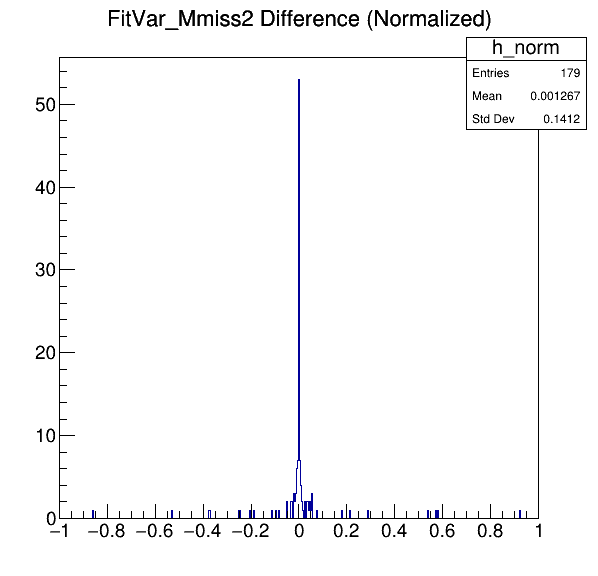 |

### `FitVar_q2`
| difference [MeV] | difference (normalized) |
|---|---|
|  |  |

### `FitVar_El`
| difference [MeV] | difference (normalized) |
|---|---|
|  |  |

### `Y_ISOLATION_BDT`
| difference [MeV] | difference (normalized) |
|---|---|
|  |  |

### `Y_ISOLATION_BDT2`
| difference [MeV] | difference (normalized) |
|---|---|
|  |  |

### `Y_ISOLATION_BDT3`
| difference [MeV] | difference (normalized) |
|---|---|
|  |  |


## Comparison between `DaVinci` version
Files used:

* `BCands_Dst-data-2012-mag_down-davinci_v36r1p2-subset`
* `BCands_Dst-data-2012-mag_down-davinci_v42r8p1-subset`

### `D0_P`
| difference [MeV] | difference (normalized) |
|---|---|
|  |  |

### `Dst_2010_minus_P`
| difference [MeV] | difference (normalized) |
|---|---|
|  |  |

### `Kplus_P`
| difference [MeV] | difference (normalized) |
|---|---|
|  | 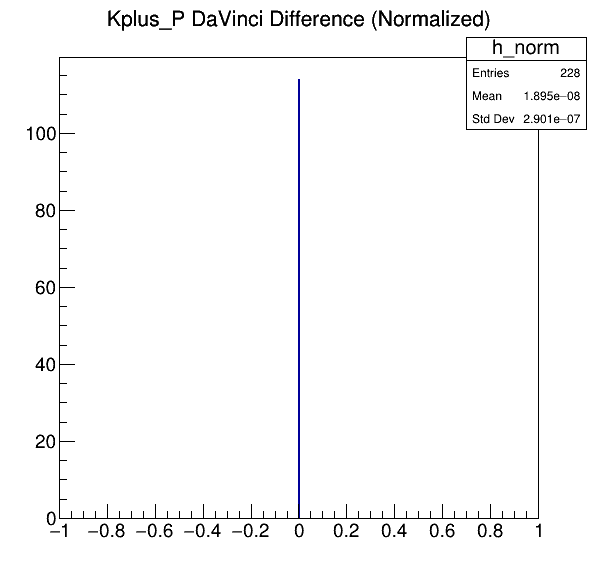 |

### `Kplus_PX`
| difference [MeV] | difference (normalized) |
|---|---|
| 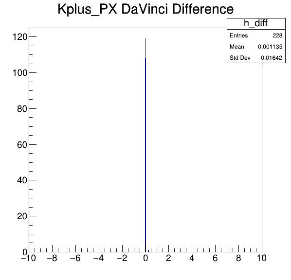 |  |

### `Kplus_PY`
| difference [MeV] | difference (normalized) |
|---|---|
|  |  |

### `Kplus_PZ`
| difference [MeV] | difference (normalized) |
|---|---|
| 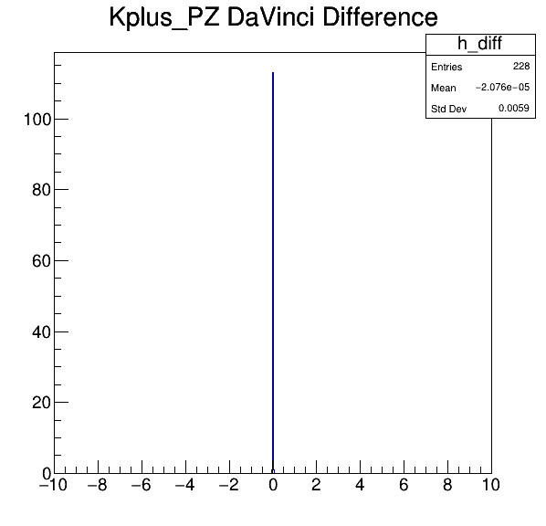 |  |

### `muplus_P`
| difference [MeV] | difference (normalized) |
|---|---|
|  | 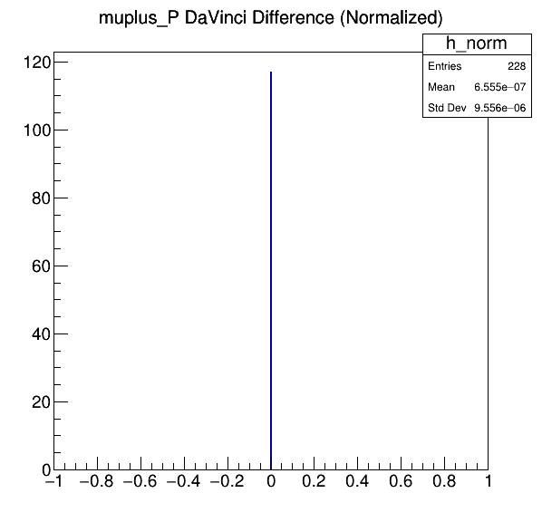 |

### `muplus_PX`
| difference [MeV] | difference (normalized) |
|---|---|
|  |  |

### `muplus_PY`
| difference [MeV] | difference (normalized) |
|---|---|
|  | 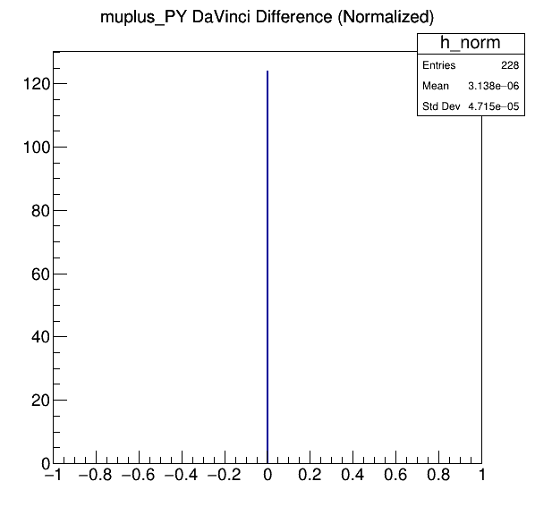 |

### `muplus_PZ`
| difference [MeV] | difference (normalized) |
|---|---|
|  |  |

### `Y_ISOLATION_BDT`
| difference [MeV] | difference (normalized) |
|---|---|
|  | 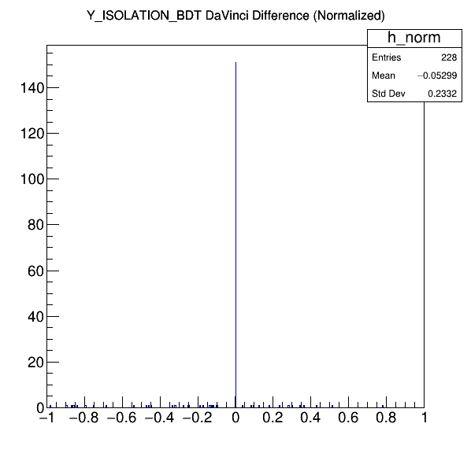 |

### `Y_ISOLATION_BDT2`
| difference [MeV] | difference (normalized) |
|---|---|
|  |  |

### `Y_ISOLATION_BDT3`
| difference [MeV] | difference (normalized) |
|---|---|
|  | 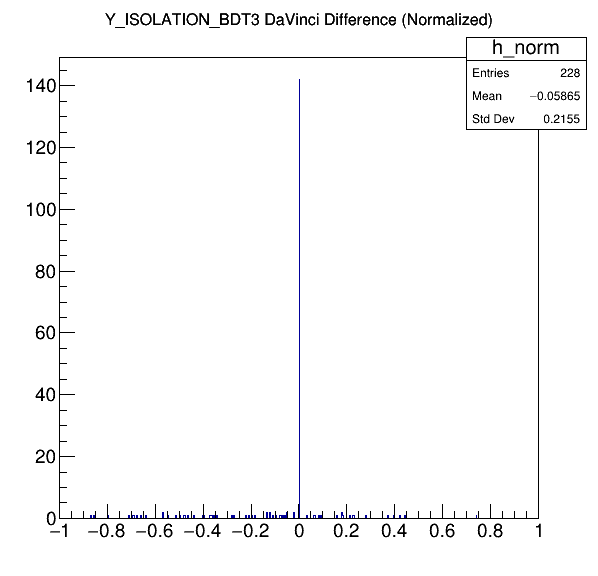 |


## Comparison between MC (Pythia 6)
Files used:

* `BCands_Dst-mc-py6-mag_down`
* `BCands_Dst-mc-py6-mag_down-subset`

### `D0_P`
| difference [MeV] | difference (normalized) |
|---|---|
| 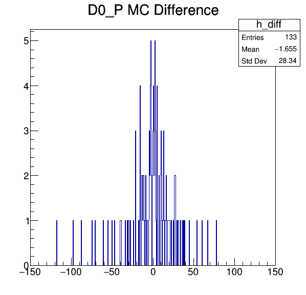 |  |

### `Kplus_P`
| difference [MeV] | difference (normalized) |
|---|---|
| 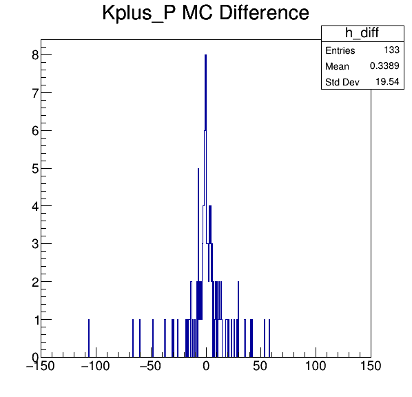 |  |

### `FitVar_Mmiss2`
| difference [MeV] | difference (normalized) |
|---|---|
|  |  |

### `FitVar_q2`
| difference [MeV] | difference (normalized) |
|---|---|
| 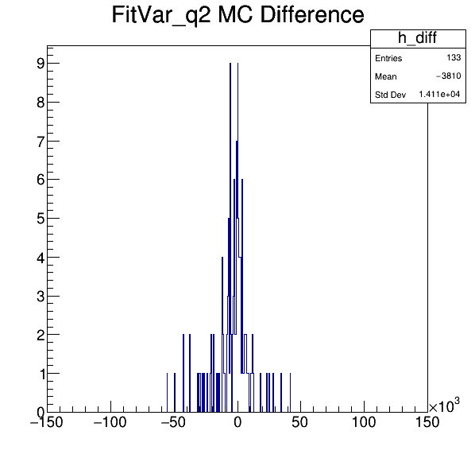 |  |

### `FitVar_El`
| difference [MeV] | difference (normalized) |
|---|---|
|  |  |

### `Y_ISOLATION_BDT`
| difference [MeV] | difference (normalized) |
|---|---|
|  |  |

### `Y_ISOLATION_BDT2`
| difference [MeV] | difference (normalized) |
|---|---|
|  |  |

### `Y_ISOLATION_BDT3`
| difference [MeV] | difference (normalized) |
|---|---|
|  |  |
