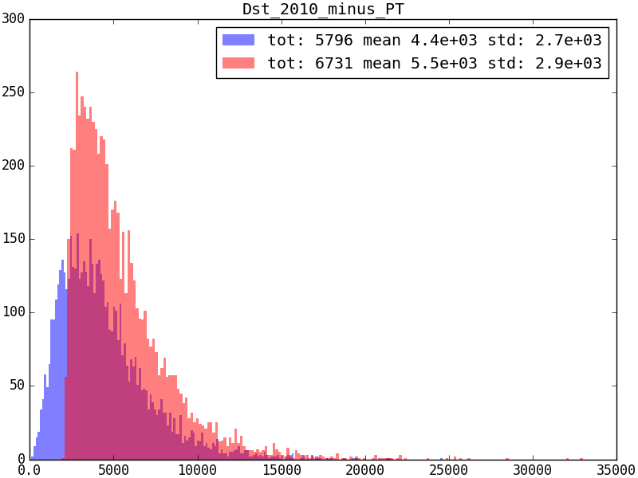

## Comparison between physical variables

For now, we focus on $P_T$ of all reconstructed particles, generated with
cocktail MC.

### `Y_PT`


### `Dst_PT`



### `D0_PT`


### `Kplus_PT`


### `muplus_PT`


### `piminus_PT`


### `piminus0_PT`


## Comparison between run 1 and run 2 individual

| cut name                                         | run 1 yield   | run 2 yield   | run 1 efficiency   | run 2 efficiency   | double ratio   |
|--------------------------------------------------|---------------|---------------|--------------------|--------------------|----------------|
| After DaVinci                                    | 5796          | 6731          | -                  | -                  | -              |
| $D^*$ L0Hadron TOS                               | 1205          | 1628          | 0.2079±0.0054      | 0.2419±0.0053      | 1.163±0.040    |
| $\Upsilon(4s)$ L0Electron TIS                    | 387           | 711           | 0.0668±0.0034      | 0.1056±0.0039      | 1.58±0.10      |
| $\Upsilon(4s)$ L0Hadron TIS                      | 1245          | 1560          | 0.2148±0.0055      | 0.2318±0.0052      | 1.079±0.037    |
| $\Upsilon(4s)$ L0Muon TIS                        | 565           | 789           | 0.0975±0.0040      | 0.1172±0.0040      | 1.202±0.065    |
| $\Upsilon(4s)$ L0Photon TIS                      | 260           | 277           | 0.0449±0.0029      | 0.0412±0.0026      | 0.917±0.082    |
| $\Upsilon(4s)$ L0Global TIS                      | 1931          | 2714          | 0.3332±0.0063      | 0.4032±0.0060      | 1.210±0.029    |
| $D^*$ L0Hadron TOS+$\Upsilon(4s)$ L0Electron TIS | 113           | 175           | 0.0938±0.0091      | 0.1075±0.0082      | 1.15±0.14      |
| $D^*$ L0Hadron TOS+$\Upsilon(4s)$ L0Hadron TIS   | 330           | 355           | 0.274±0.013        | 0.218±0.011        | 0.796±0.055    |
| $D^*$ L0Hadron TOS+$\Upsilon(4s)$ L0Muon TIS     | 135           | 147           | 0.1120±0.0098      | 0.0903±0.0076      | 0.806±0.098    |
| $D^*$ L0Hadron TOS+$\Upsilon(4s)$ L0Photon TIS   | 68            | 72            | 0.0564±0.0074      | 0.0442±0.0057      | 0.78±0.14      |
| $D^*$ L0Hadron TOS+$\Upsilon(4s)$ L0Global TIS   | 489           | 578           | 0.406±0.015        | 0.355±0.012        | 0.875±0.043    |
| Total ratio                                      | -             | -             | 0.0844±0.0038      | 0.0859±0.0035      | 1.018±0.062    |

!!! note
    Only lines present in both runs are considered here.


## Run 1 detail

!!! note Generation

    These cutflows, for both run 1 and 2, are generated with :

    ```
    make cutflow-Dst-detail-individual
    ```

    The output will be printed out to terminal.

### Marginal impact

| cut name                                                                             |   yield | efficiency      |
|--------------------------------------------------------------------------------------|---------|-----------------|
| After DaVinci                                                                        |    5796 | -               |
| $D^*$ L0Hadron TOS                                                                   |    1205 | 0.208+/-0.005   |
| $D^*$ L0Hadron TOS+$\Upsilon(4s)$ L0Electron TIS                                     |     113 | 0.094+/-0.009   |
| $D^*$ L0Hadron TOS+$\Upsilon(4s)$ L0Electron TIS+$\Upsilon(4s)$ L0ElectronHi TIS     |      35 | 0.029+/-0.006   |
| $D^*$ L0Hadron TOS+$\Upsilon(4s)$ L0Electron TIS+$\Upsilon(4s)$ L0Hadron TIS         |      65 | 0.054+/-0.007   |
| $D^*$ L0Hadron TOS+$\Upsilon(4s)$ L0Electron TIS+$\Upsilon(4s)$ L0HighSumETJet TIS   |       0 | 0.0000+/-0.0015 |
| $D^*$ L0Hadron TOS+$\Upsilon(4s)$ L0Electron TIS+$\Upsilon(4s)$ L0Muon TIS           |      16 | 0.013+/-0.004   |
| $D^*$ L0Hadron TOS+$\Upsilon(4s)$ L0Electron TIS+$\Upsilon(4s)$ L0NoPVFlag TIS       |       0 | 0.0000+/-0.0015 |
| $D^*$ L0Hadron TOS+$\Upsilon(4s)$ L0Electron TIS+$\Upsilon(4s)$ L0Photon TIS         |      17 | 0.014+/-0.004   |
| $D^*$ L0Hadron TOS+$\Upsilon(4s)$ L0Electron TIS+$\Upsilon(4s)$ L0PhotonHi TIS       |      10 | 0.0083+/-0.0035 |
| $D^*$ L0Hadron TOS+$\Upsilon(4s)$ L0Electron TIS+$\Upsilon(4s)$ L0Global TIS         |     113 | 0.094+/-0.009   |
| $D^*$ L0Hadron TOS+$\Upsilon(4s)$ L0ElectronHi TIS                                   |      35 | 0.029+/-0.006   |
| $D^*$ L0Hadron TOS+$\Upsilon(4s)$ L0ElectronHi TIS+$\Upsilon(4s)$ L0Electron TIS     |      35 | 0.029+/-0.006   |
| $D^*$ L0Hadron TOS+$\Upsilon(4s)$ L0ElectronHi TIS+$\Upsilon(4s)$ L0Hadron TIS       |      22 | 0.018+/-0.005   |
| $D^*$ L0Hadron TOS+$\Upsilon(4s)$ L0ElectronHi TIS+$\Upsilon(4s)$ L0HighSumETJet TIS |       0 | 0.0000+/-0.0015 |
| $D^*$ L0Hadron TOS+$\Upsilon(4s)$ L0ElectronHi TIS+$\Upsilon(4s)$ L0Muon TIS         |       4 | 0.0033+/-0.0026 |
| $D^*$ L0Hadron TOS+$\Upsilon(4s)$ L0ElectronHi TIS+$\Upsilon(4s)$ L0NoPVFlag TIS     |       0 | 0.0000+/-0.0015 |
| $D^*$ L0Hadron TOS+$\Upsilon(4s)$ L0ElectronHi TIS+$\Upsilon(4s)$ L0Photon TIS       |       6 | 0.0050+/-0.0029 |
| $D^*$ L0Hadron TOS+$\Upsilon(4s)$ L0ElectronHi TIS+$\Upsilon(4s)$ L0PhotonHi TIS     |       4 | 0.0033+/-0.0026 |
| $D^*$ L0Hadron TOS+$\Upsilon(4s)$ L0ElectronHi TIS+$\Upsilon(4s)$ L0Global TIS       |      35 | 0.029+/-0.006   |
| $D^*$ L0Hadron TOS+$\Upsilon(4s)$ L0Hadron TIS                                       |     330 | 0.274+/-0.013   |
| $D^*$ L0Hadron TOS+$\Upsilon(4s)$ L0Hadron TIS+$\Upsilon(4s)$ L0Electron TIS         |      65 | 0.054+/-0.007   |
| $D^*$ L0Hadron TOS+$\Upsilon(4s)$ L0Hadron TIS+$\Upsilon(4s)$ L0ElectronHi TIS       |      22 | 0.018+/-0.005   |
| $D^*$ L0Hadron TOS+$\Upsilon(4s)$ L0Hadron TIS+$\Upsilon(4s)$ L0HighSumETJet TIS     |       0 | 0.0000+/-0.0015 |
| $D^*$ L0Hadron TOS+$\Upsilon(4s)$ L0Hadron TIS+$\Upsilon(4s)$ L0Muon TIS             |      40 | 0.033+/-0.006   |
| $D^*$ L0Hadron TOS+$\Upsilon(4s)$ L0Hadron TIS+$\Upsilon(4s)$ L0NoPVFlag TIS         |       0 | 0.0000+/-0.0015 |
| $D^*$ L0Hadron TOS+$\Upsilon(4s)$ L0Hadron TIS+$\Upsilon(4s)$ L0Photon TIS           |      36 | 0.030+/-0.006   |
| $D^*$ L0Hadron TOS+$\Upsilon(4s)$ L0Hadron TIS+$\Upsilon(4s)$ L0PhotonHi TIS         |      12 | 0.010+/-0.004   |
| $D^*$ L0Hadron TOS+$\Upsilon(4s)$ L0Hadron TIS+$\Upsilon(4s)$ L0Global TIS           |     330 | 0.274+/-0.013   |
| $D^*$ L0Hadron TOS+$\Upsilon(4s)$ L0HighSumETJet TIS                                 |       0 | 0.0000+/-0.0015 |
| $D^*$ L0Hadron TOS+$\Upsilon(4s)$ L0HighSumETJet TIS+$\Upsilon(4s)$ L0Electron TIS   |       0 | 0.0000+/-0.0015 |
| $D^*$ L0Hadron TOS+$\Upsilon(4s)$ L0HighSumETJet TIS+$\Upsilon(4s)$ L0ElectronHi TIS |       0 | 0.0000+/-0.0015 |
| $D^*$ L0Hadron TOS+$\Upsilon(4s)$ L0HighSumETJet TIS+$\Upsilon(4s)$ L0Hadron TIS     |       0 | 0.0000+/-0.0015 |
| $D^*$ L0Hadron TOS+$\Upsilon(4s)$ L0HighSumETJet TIS+$\Upsilon(4s)$ L0Muon TIS       |       0 | 0.0000+/-0.0015 |
| $D^*$ L0Hadron TOS+$\Upsilon(4s)$ L0HighSumETJet TIS+$\Upsilon(4s)$ L0NoPVFlag TIS   |       0 | 0.0000+/-0.0015 |
| $D^*$ L0Hadron TOS+$\Upsilon(4s)$ L0HighSumETJet TIS+$\Upsilon(4s)$ L0Photon TIS     |       0 | 0.0000+/-0.0015 |
| $D^*$ L0Hadron TOS+$\Upsilon(4s)$ L0HighSumETJet TIS+$\Upsilon(4s)$ L0PhotonHi TIS   |       0 | 0.0000+/-0.0015 |
| $D^*$ L0Hadron TOS+$\Upsilon(4s)$ L0HighSumETJet TIS+$\Upsilon(4s)$ L0Global TIS     |       0 | 0.0000+/-0.0015 |
| $D^*$ L0Hadron TOS+$\Upsilon(4s)$ L0Muon TIS                                         |     135 | 0.112+/-0.010   |
| $D^*$ L0Hadron TOS+$\Upsilon(4s)$ L0Muon TIS+$\Upsilon(4s)$ L0Electron TIS           |      16 | 0.013+/-0.004   |
| $D^*$ L0Hadron TOS+$\Upsilon(4s)$ L0Muon TIS+$\Upsilon(4s)$ L0ElectronHi TIS         |       4 | 0.0033+/-0.0026 |
| $D^*$ L0Hadron TOS+$\Upsilon(4s)$ L0Muon TIS+$\Upsilon(4s)$ L0Hadron TIS             |      40 | 0.033+/-0.006   |
| $D^*$ L0Hadron TOS+$\Upsilon(4s)$ L0Muon TIS+$\Upsilon(4s)$ L0HighSumETJet TIS       |       0 | 0.0000+/-0.0015 |
| $D^*$ L0Hadron TOS+$\Upsilon(4s)$ L0Muon TIS+$\Upsilon(4s)$ L0NoPVFlag TIS           |       0 | 0.0000+/-0.0015 |
| $D^*$ L0Hadron TOS+$\Upsilon(4s)$ L0Muon TIS+$\Upsilon(4s)$ L0Photon TIS             |       7 | 0.0058+/-0.0031 |
| $D^*$ L0Hadron TOS+$\Upsilon(4s)$ L0Muon TIS+$\Upsilon(4s)$ L0PhotonHi TIS           |       3 | 0.0025+/-0.0024 |
| $D^*$ L0Hadron TOS+$\Upsilon(4s)$ L0Muon TIS+$\Upsilon(4s)$ L0Global TIS             |     135 | 0.112+/-0.010   |
| $D^*$ L0Hadron TOS+$\Upsilon(4s)$ L0NoPVFlag TIS                                     |       0 | 0.0000+/-0.0015 |
| $D^*$ L0Hadron TOS+$\Upsilon(4s)$ L0NoPVFlag TIS+$\Upsilon(4s)$ L0Electron TIS       |       0 | 0.0000+/-0.0015 |
| $D^*$ L0Hadron TOS+$\Upsilon(4s)$ L0NoPVFlag TIS+$\Upsilon(4s)$ L0ElectronHi TIS     |       0 | 0.0000+/-0.0015 |
| $D^*$ L0Hadron TOS+$\Upsilon(4s)$ L0NoPVFlag TIS+$\Upsilon(4s)$ L0Hadron TIS         |       0 | 0.0000+/-0.0015 |
| $D^*$ L0Hadron TOS+$\Upsilon(4s)$ L0NoPVFlag TIS+$\Upsilon(4s)$ L0HighSumETJet TIS   |       0 | 0.0000+/-0.0015 |
| $D^*$ L0Hadron TOS+$\Upsilon(4s)$ L0NoPVFlag TIS+$\Upsilon(4s)$ L0Muon TIS           |       0 | 0.0000+/-0.0015 |
| $D^*$ L0Hadron TOS+$\Upsilon(4s)$ L0NoPVFlag TIS+$\Upsilon(4s)$ L0Photon TIS         |       0 | 0.0000+/-0.0015 |
| $D^*$ L0Hadron TOS+$\Upsilon(4s)$ L0NoPVFlag TIS+$\Upsilon(4s)$ L0PhotonHi TIS       |       0 | 0.0000+/-0.0015 |
| $D^*$ L0Hadron TOS+$\Upsilon(4s)$ L0NoPVFlag TIS+$\Upsilon(4s)$ L0Global TIS         |       0 | 0.0000+/-0.0015 |
| $D^*$ L0Hadron TOS+$\Upsilon(4s)$ L0Photon TIS                                       |      68 | 0.056+/-0.007   |
| $D^*$ L0Hadron TOS+$\Upsilon(4s)$ L0Photon TIS+$\Upsilon(4s)$ L0Electron TIS         |      17 | 0.014+/-0.004   |
| $D^*$ L0Hadron TOS+$\Upsilon(4s)$ L0Photon TIS+$\Upsilon(4s)$ L0ElectronHi TIS       |       6 | 0.0050+/-0.0029 |
| $D^*$ L0Hadron TOS+$\Upsilon(4s)$ L0Photon TIS+$\Upsilon(4s)$ L0Hadron TIS           |      36 | 0.030+/-0.006   |
| $D^*$ L0Hadron TOS+$\Upsilon(4s)$ L0Photon TIS+$\Upsilon(4s)$ L0HighSumETJet TIS     |       0 | 0.0000+/-0.0015 |
| $D^*$ L0Hadron TOS+$\Upsilon(4s)$ L0Photon TIS+$\Upsilon(4s)$ L0Muon TIS             |       7 | 0.0058+/-0.0031 |
| $D^*$ L0Hadron TOS+$\Upsilon(4s)$ L0Photon TIS+$\Upsilon(4s)$ L0NoPVFlag TIS         |       0 | 0.0000+/-0.0015 |
| $D^*$ L0Hadron TOS+$\Upsilon(4s)$ L0Photon TIS+$\Upsilon(4s)$ L0PhotonHi TIS         |      19 | 0.016+/-0.004   |
| $D^*$ L0Hadron TOS+$\Upsilon(4s)$ L0Photon TIS+$\Upsilon(4s)$ L0Global TIS           |      68 | 0.056+/-0.007   |
| $D^*$ L0Hadron TOS+$\Upsilon(4s)$ L0PhotonHi TIS                                     |      19 | 0.016+/-0.004   |
| $D^*$ L0Hadron TOS+$\Upsilon(4s)$ L0PhotonHi TIS+$\Upsilon(4s)$ L0Electron TIS       |      10 | 0.0083+/-0.0035 |
| $D^*$ L0Hadron TOS+$\Upsilon(4s)$ L0PhotonHi TIS+$\Upsilon(4s)$ L0ElectronHi TIS     |       4 | 0.0033+/-0.0026 |
| $D^*$ L0Hadron TOS+$\Upsilon(4s)$ L0PhotonHi TIS+$\Upsilon(4s)$ L0Hadron TIS         |      12 | 0.010+/-0.004   |
| $D^*$ L0Hadron TOS+$\Upsilon(4s)$ L0PhotonHi TIS+$\Upsilon(4s)$ L0HighSumETJet TIS   |       0 | 0.0000+/-0.0015 |
| $D^*$ L0Hadron TOS+$\Upsilon(4s)$ L0PhotonHi TIS+$\Upsilon(4s)$ L0Muon TIS           |       3 | 0.0025+/-0.0024 |
| $D^*$ L0Hadron TOS+$\Upsilon(4s)$ L0PhotonHi TIS+$\Upsilon(4s)$ L0NoPVFlag TIS       |       0 | 0.0000+/-0.0015 |
| $D^*$ L0Hadron TOS+$\Upsilon(4s)$ L0PhotonHi TIS+$\Upsilon(4s)$ L0Photon TIS         |      19 | 0.016+/-0.004   |
| $D^*$ L0Hadron TOS+$\Upsilon(4s)$ L0PhotonHi TIS+$\Upsilon(4s)$ L0Global TIS         |      19 | 0.016+/-0.004   |
| $D^*$ L0Hadron TOS+$\Upsilon(4s)$ L0Global TIS                                       |     489 | 0.406+/-0.015   |

### Individual impact

| cut name                                             |   yield | efficiency        |
|------------------------------------------------------|---------|-------------------|
| After DaVinci                                        |    5796 | -                 |
| $D^*$ L0Hadron TOS                                   |    1205 | 0.208+/-0.005     |
| $\Upsilon(4s)$ L0Electron TIS                        |     387 | 0.0668+/-0.0034   |
| $\Upsilon(4s)$ L0ElectronHi TIS                      |      94 | 0.0162+/-0.0018   |
| $\Upsilon(4s)$ L0Hadron TIS                          |    1245 | 0.215+/-0.006     |
| $\Upsilon(4s)$ L0HighSumETJet TIS                    |       0 | 0.00000+/-0.00032 |
| $\Upsilon(4s)$ L0Muon TIS                            |     565 | 0.097+/-0.004     |
| $\Upsilon(4s)$ L0NoPVFlag TIS                        |       0 | 0.00000+/-0.00032 |
| $\Upsilon(4s)$ L0Photon TIS                          |     260 | 0.0449+/-0.0029   |
| $\Upsilon(4s)$ L0PhotonHi TIS                        |      63 | 0.0109+/-0.0015   |
| $\Upsilon(4s)$ L0Global TIS                          |    1931 | 0.333+/-0.006     |
| $D^*$ L0Hadron TOS+$\Upsilon(4s)$ L0Electron TIS     |     113 | 0.094+/-0.009     |
| $D^*$ L0Hadron TOS+$\Upsilon(4s)$ L0ElectronHi TIS   |      35 | 0.029+/-0.006     |
| $D^*$ L0Hadron TOS+$\Upsilon(4s)$ L0Hadron TIS       |     330 | 0.274+/-0.013     |
| $D^*$ L0Hadron TOS+$\Upsilon(4s)$ L0HighSumETJet TIS |       0 | 0.0000+/-0.0015   |
| $D^*$ L0Hadron TOS+$\Upsilon(4s)$ L0Muon TIS         |     135 | 0.112+/-0.010     |
| $D^*$ L0Hadron TOS+$\Upsilon(4s)$ L0NoPVFlag TIS     |       0 | 0.0000+/-0.0015   |
| $D^*$ L0Hadron TOS+$\Upsilon(4s)$ L0Photon TIS       |      68 | 0.056+/-0.007     |
| $D^*$ L0Hadron TOS+$\Upsilon(4s)$ L0PhotonHi TIS     |      19 | 0.016+/-0.004     |
| $D^*$ L0Hadron TOS+$\Upsilon(4s)$ L0Global TIS       |     489 | 0.406+/-0.015     |


## Run 2 detail

### Marginal impact

| cut name                                                                                                                       |   yield | efficiency      |
|--------------------------------------------------------------------------------------------------------------------------------|---------|-----------------|
| After DaVinci                                                                                                                  |    6731 | -               |
| $D^*$ L0Hadron TOS                                                                                                             |    1628 | 0.242+/-0.005   |
| $D^*$ L0Hadron TOS+$\Upsilon(4s)$ L0DiMuon TIS                                                                                 |      36 | 0.022+/-0.004   |
| $D^*$ L0Hadron TOS+$\Upsilon(4s)$ L0DiMuon TIS+$\Upsilon(4s)$ L0Electron TIS                                                   |       6 | 0.0037+/-0.0022 |
| $D^*$ L0Hadron TOS+$\Upsilon(4s)$ L0DiMuon TIS+$\Upsilon(4s)$ L0Hadron TIS                                                     |       8 | 0.0049+/-0.0024 |
| $D^*$ L0Hadron TOS+$\Upsilon(4s)$ L0DiMuon TIS+$\Upsilon(4s)$ L0JetEl TIS                                                      |       0 | 0.0000+/-0.0011 |
| $D^*$ L0Hadron TOS+$\Upsilon(4s)$ L0DiMuon TIS+$\Upsilon(4s)$ L0JetPh TIS                                                      |       0 | 0.0000+/-0.0011 |
| $D^*$ L0Hadron TOS+$\Upsilon(4s)$ L0DiMuon TIS+$\Upsilon(4s)$ L0Muon TIS                                                       |      35 | 0.021+/-0.004   |
| $D^*$ L0Hadron TOS+$\Upsilon(4s)$ L0DiMuon TIS+$\Upsilon(4s)$ L0MuonEW TIS                                                     |       9 | 0.0055+/-0.0025 |
| $D^*$ L0Hadron TOS+$\Upsilon(4s)$ L0DiMuon TIS+$\Upsilon(4s)$ L0Photon TIS                                                     |       1 | 0.0006+/-0.0014 |
| $D^*$ L0Hadron TOS+$\Upsilon(4s)$ L0DiMuon TIS+$\Upsilon(4s)$ L0Global TIS                                                     |      36 | 0.022+/-0.004   |
| $D^*$ L0Hadron TOS+$\Upsilon(4s)$ L0Electron TIS                                                                               |     175 | 0.107+/-0.008   |
| $D^*$ L0Hadron TOS+$\Upsilon(4s)$ L0Electron TIS+$\Upsilon(4s)$ L0DiMuon TIS                                                   |       6 | 0.0037+/-0.0022 |
| $D^*$ L0Hadron TOS+$\Upsilon(4s)$ L0Electron TIS+$\Upsilon(4s)$ L0Hadron TIS                                                   |      85 | 0.052+/-0.006   |
| $D^*$ L0Hadron TOS+$\Upsilon(4s)$ L0Electron TIS+$\Upsilon(4s)$ L0JetEl TIS                                                    |       8 | 0.0049+/-0.0024 |
| $D^*$ L0Hadron TOS+$\Upsilon(4s)$ L0Electron TIS+$\Upsilon(4s)$ L0JetPh TIS                                                    |       1 | 0.0006+/-0.0014 |
| $D^*$ L0Hadron TOS+$\Upsilon(4s)$ L0Electron TIS+$\Upsilon(4s)$ L0Muon TIS                                                     |      16 | 0.0098+/-0.0031 |
| $D^*$ L0Hadron TOS+$\Upsilon(4s)$ L0Electron TIS+$\Upsilon(4s)$ L0MuonEW TIS                                                   |       8 | 0.0049+/-0.0024 |
| $D^*$ L0Hadron TOS+$\Upsilon(4s)$ L0Electron TIS+$\Upsilon(4s)$ L0Photon TIS                                                   |      15 | 0.0092+/-0.0030 |
| $D^*$ L0Hadron TOS+$\Upsilon(4s)$ L0Electron TIS+$\Upsilon(4s)$ L0Global TIS                                                   |     175 | 0.107+/-0.008   |
| $D^*$ L0Hadron TOS+$\Upsilon(4s)$ L0Hadron TIS                                                                                 |     355 | 0.218+/-0.011   |
| $D^*$ L0Hadron TOS+$\Upsilon(4s)$ L0Hadron TIS+$\Upsilon(4s)$ L0DiMuon TIS                                                     |       8 | 0.0049+/-0.0024 |
| $D^*$ L0Hadron TOS+$\Upsilon(4s)$ L0Hadron TIS+$\Upsilon(4s)$ L0Electron TIS                                                   |      85 | 0.052+/-0.006   |
| $D^*$ L0Hadron TOS+$\Upsilon(4s)$ L0Hadron TIS+$\Upsilon(4s)$ L0JetEl TIS                                                      |       8 | 0.0049+/-0.0024 |
| $D^*$ L0Hadron TOS+$\Upsilon(4s)$ L0Hadron TIS+$\Upsilon(4s)$ L0JetPh TIS                                                      |       2 | 0.0012+/-0.0016 |
| $D^*$ L0Hadron TOS+$\Upsilon(4s)$ L0Hadron TIS+$\Upsilon(4s)$ L0Muon TIS                                                       |      31 | 0.019+/-0.004   |
| $D^*$ L0Hadron TOS+$\Upsilon(4s)$ L0Hadron TIS+$\Upsilon(4s)$ L0MuonEW TIS                                                     |       9 | 0.0055+/-0.0025 |
| $D^*$ L0Hadron TOS+$\Upsilon(4s)$ L0Hadron TIS+$\Upsilon(4s)$ L0Photon TIS                                                     |      33 | 0.020+/-0.004   |
| $D^*$ L0Hadron TOS+$\Upsilon(4s)$ L0Hadron TIS+$\Upsilon(4s)$ L0Global TIS                                                     |     355 | 0.218+/-0.011   |
| $D^*$ L0Hadron TOS+$\Upsilon(4s)$ L0JetEl TIS                                                                                  |       8 | 0.0049+/-0.0024 |
| $D^*$ L0Hadron TOS+$\Upsilon(4s)$ L0JetEl TIS+$\Upsilon(4s)$ L0DiMuon TIS                                                      |       0 | 0.0000+/-0.0011 |
| $D^*$ L0Hadron TOS+$\Upsilon(4s)$ L0JetEl TIS+$\Upsilon(4s)$ L0Electron TIS                                                    |       8 | 0.0049+/-0.0024 |
| $D^*$ L0Hadron TOS+$\Upsilon(4s)$ L0JetEl TIS+$\Upsilon(4s)$ L0Hadron TIS                                                      |       8 | 0.0049+/-0.0024 |
| $D^*$ L0Hadron TOS+$\Upsilon(4s)$ L0JetEl TIS+$\Upsilon(4s)$ L0JetPh TIS                                                       |       0 | 0.0000+/-0.0011 |
| $D^*$ L0Hadron TOS+$\Upsilon(4s)$ L0JetEl TIS+$\Upsilon(4s)$ L0Muon TIS                                                        |       0 | 0.0000+/-0.0011 |
| $D^*$ L0Hadron TOS+$\Upsilon(4s)$ L0JetEl TIS+$\Upsilon(4s)$ L0MuonEW TIS                                                      |       0 | 0.0000+/-0.0011 |
| $D^*$ L0Hadron TOS+$\Upsilon(4s)$ L0JetEl TIS+$\Upsilon(4s)$ L0Photon TIS                                                      |       1 | 0.0006+/-0.0014 |
| $D^*$ L0Hadron TOS+$\Upsilon(4s)$ L0JetEl TIS+$\Upsilon(4s)$ L0Global TIS                                                      |       8 | 0.0049+/-0.0024 |
| $D^*$ L0Hadron TOS+$\Upsilon(4s)$ L0JetPh TIS                                                                                  |       2 | 0.0012+/-0.0016 |
| $D^*$ L0Hadron TOS+$\Upsilon(4s)$ L0JetPh TIS+$\Upsilon(4s)$ L0DiMuon TIS                                                      |       0 | 0.0000+/-0.0011 |
| $D^*$ L0Hadron TOS+$\Upsilon(4s)$ L0JetPh TIS+$\Upsilon(4s)$ L0Electron TIS                                                    |       1 | 0.0006+/-0.0014 |
| $D^*$ L0Hadron TOS+$\Upsilon(4s)$ L0JetPh TIS+$\Upsilon(4s)$ L0Hadron TIS                                                      |       2 | 0.0012+/-0.0016 |
| $D^*$ L0Hadron TOS+$\Upsilon(4s)$ L0JetPh TIS+$\Upsilon(4s)$ L0JetEl TIS                                                       |       0 | 0.0000+/-0.0011 |
| $D^*$ L0Hadron TOS+$\Upsilon(4s)$ L0JetPh TIS+$\Upsilon(4s)$ L0Muon TIS                                                        |       1 | 0.0006+/-0.0014 |
| $D^*$ L0Hadron TOS+$\Upsilon(4s)$ L0JetPh TIS+$\Upsilon(4s)$ L0MuonEW TIS                                                      |       0 | 0.0000+/-0.0011 |
| $D^*$ L0Hadron TOS+$\Upsilon(4s)$ L0JetPh TIS+$\Upsilon(4s)$ L0Photon TIS                                                      |       2 | 0.0012+/-0.0016 |
| $D^*$ L0Hadron TOS+$\Upsilon(4s)$ L0JetPh TIS+$\Upsilon(4s)$ L0Global TIS                                                      |       2 | 0.0012+/-0.0016 |
| $D^*$ L0Hadron TOS+$\Upsilon(4s)$ L0Muon TIS                                                                                   |     147 | 0.090+/-0.008   |
| $D^*$ L0Hadron TOS+$\Upsilon(4s)$ L0Muon TIS+$\Upsilon(4s)$ L0DiMuon TIS                                                       |      35 | 0.021+/-0.004   |
| $D^*$ L0Hadron TOS+$\Upsilon(4s)$ L0Muon TIS+$\Upsilon(4s)$ L0Electron TIS                                                     |      16 | 0.0098+/-0.0031 |
| $D^*$ L0Hadron TOS+$\Upsilon(4s)$ L0Muon TIS+$\Upsilon(4s)$ L0Hadron TIS                                                       |      31 | 0.019+/-0.004   |
| $D^*$ L0Hadron TOS+$\Upsilon(4s)$ L0Muon TIS+$\Upsilon(4s)$ L0JetEl TIS                                                        |       0 | 0.0000+/-0.0011 |
| $D^*$ L0Hadron TOS+$\Upsilon(4s)$ L0Muon TIS+$\Upsilon(4s)$ L0JetPh TIS                                                        |       1 | 0.0006+/-0.0014 |
| $D^*$ L0Hadron TOS+$\Upsilon(4s)$ L0Muon TIS+$\Upsilon(4s)$ L0MuonEW TIS                                                       |      37 | 0.023+/-0.004   |
| $D^*$ L0Hadron TOS+$\Upsilon(4s)$ L0Muon TIS+$\Upsilon(4s)$ L0Photon TIS                                                       |       8 | 0.0049+/-0.0024 |
| $D^*$ L0Hadron TOS+$\Upsilon(4s)$ L0Muon TIS+$\Upsilon(4s)$ L0Global TIS                                                       |     147 | 0.090+/-0.008   |
| $D^*$ L0Hadron TOS+$\Upsilon(4s)$ L0MuonEW TIS                                                                                 |      37 | 0.023+/-0.004   |
| $D^*$ L0Hadron TOS+$\Upsilon(4s)$ L0MuonEW TIS+$\Upsilon(4s)$ L0DiMuon TIS                                                     |       9 | 0.0055+/-0.0025 |
| $D^*$ L0Hadron TOS+$\Upsilon(4s)$ L0MuonEW TIS+$\Upsilon(4s)$ L0Electron TIS                                                   |       8 | 0.0049+/-0.0024 |
| $D^*$ L0Hadron TOS+$\Upsilon(4s)$ L0MuonEW TIS+$\Upsilon(4s)$ L0Hadron TIS                                                     |       9 | 0.0055+/-0.0025 |
| $D^*$ L0Hadron TOS+$\Upsilon(4s)$ L0MuonEW TIS+$\Upsilon(4s)$ L0JetEl TIS                                                      |       0 | 0.0000+/-0.0011 |
| $D^*$ L0Hadron TOS+$\Upsilon(4s)$ L0MuonEW TIS+$\Upsilon(4s)$ L0JetPh TIS                                                      |       0 | 0.0000+/-0.0011 |
| $D^*$ L0Hadron TOS+$\Upsilon(4s)$ L0MuonEW TIS+$\Upsilon(4s)$ L0Muon TIS                                                       |      37 | 0.023+/-0.004   |
| $D^*$ L0Hadron TOS+$\Upsilon(4s)$ L0MuonEW TIS+$\Upsilon(4s)$ L0Photon TIS                                                     |       3 | 0.0018+/-0.0018 |
| $D^*$ L0Hadron TOS+$\Upsilon(4s)$ L0MuonEW TIS+$\Upsilon(4s)$ L0Global TIS                                                     |      37 | 0.023+/-0.004   |
| $D^*$ L0Hadron TOS+$\Upsilon(4s)$ L0Photon TIS                                                                                 |      72 | 0.044+/-0.006   |
| $D^*$ L0Hadron TOS+$\Upsilon(4s)$ L0Photon TIS+$\Upsilon(4s)$ L0DiMuon TIS                                                     |       1 | 0.0006+/-0.0014 |
| $D^*$ L0Hadron TOS+$\Upsilon(4s)$ L0Photon TIS+$\Upsilon(4s)$ L0Electron TIS                                                   |      15 | 0.0092+/-0.0030 |
| $D^*$ L0Hadron TOS+$\Upsilon(4s)$ L0Photon TIS+$\Upsilon(4s)$ L0Hadron TIS                                                     |      33 | 0.020+/-0.004   |
| $D^*$ L0Hadron TOS+$\Upsilon(4s)$ L0Photon TIS+$\Upsilon(4s)$ L0JetEl TIS                                                      |       1 | 0.0006+/-0.0014 |
| $D^*$ L0Hadron TOS+$\Upsilon(4s)$ L0Photon TIS+$\Upsilon(4s)$ L0JetPh TIS                                                      |       2 | 0.0012+/-0.0016 |
| $D^*$ L0Hadron TOS+$\Upsilon(4s)$ L0Photon TIS+$\Upsilon(4s)$ L0Muon TIS                                                       |       8 | 0.0049+/-0.0024 |
| $D^*$ L0Hadron TOS+$\Upsilon(4s)$ L0Photon TIS+$\Upsilon(4s)$ L0MuonEW TIS                                                     |       3 | 0.0018+/-0.0018 |
| $D^*$ L0Hadron TOS+$\Upsilon(4s)$ L0Photon TIS+$\Upsilon(4s)$ L0Global TIS                                                     |      72 | 0.044+/-0.006   |
| $D^*$ L0Hadron TOS+$\Upsilon(4s)$ L0Global TIS                                                                                 |     578 | 0.355+/-0.012   |
| $D^*$ L0Hadron TOS+$\Upsilon(4s)$ L0Global TIS+$\Upsilon(4s)$ Hlt1TwoTrackMVA TIS                                              |     167 | 0.289+/-0.020   |
| $D^*$ L0Hadron TOS+$\Upsilon(4s)$ L0Global TIS+$\Upsilon(4s)$ Hlt1TwoTrackMVA TIS+$\Upsilon(4s)$ Hlt1TrackMVALoose TIS         |     118 | 0.204+/-0.018   |
| $D^*$ L0Hadron TOS+$\Upsilon(4s)$ L0Global TIS+$\Upsilon(4s)$ Hlt1TwoTrackMVA TIS+$\Upsilon(4s)$ Hlt1TwoTrackMVALoose TIS      |     167 | 0.289+/-0.020   |
| $D^*$ L0Hadron TOS+$\Upsilon(4s)$ L0Global TIS+$\Upsilon(4s)$ Hlt1TwoTrackMVA TIS+$\Upsilon(4s)$ Hlt1TrackMuon TIS             |      23 | 0.040+/-0.010   |
| $D^*$ L0Hadron TOS+$\Upsilon(4s)$ L0Global TIS+$\Upsilon(4s)$ Hlt1TwoTrackMVA TIS+$\Upsilon(4s)$ Hlt1TrackMuonMVA TIS          |      15 | 0.026+/-0.008   |
| $D^*$ L0Hadron TOS+$\Upsilon(4s)$ L0Global TIS+$\Upsilon(4s)$ Hlt1TwoTrackMVA TIS+$\Upsilon(4s)$ Hlt1SingleMuonHighPT TIS      |       3 | 0.005+/-0.005   |
| $D^*$ L0Hadron TOS+$\Upsilon(4s)$ L0Global TIS+$\Upsilon(4s)$ Hlt1TwoTrackMVA TIS+$\Upsilon(4s)$ Hlt1Phys TIS                  |     167 | 0.289+/-0.020   |
| $D^*$ L0Hadron TOS+$\Upsilon(4s)$ L0Global TIS+$\Upsilon(4s)$ Hlt1TrackMVALoose TIS                                            |     185 | 0.320+/-0.020   |
| $D^*$ L0Hadron TOS+$\Upsilon(4s)$ L0Global TIS+$\Upsilon(4s)$ Hlt1TrackMVALoose TIS+$\Upsilon(4s)$ Hlt1TwoTrackMVA TIS         |     118 | 0.204+/-0.018   |
| $D^*$ L0Hadron TOS+$\Upsilon(4s)$ L0Global TIS+$\Upsilon(4s)$ Hlt1TrackMVALoose TIS+$\Upsilon(4s)$ Hlt1TwoTrackMVALoose TIS    |     118 | 0.204+/-0.018   |
| $D^*$ L0Hadron TOS+$\Upsilon(4s)$ L0Global TIS+$\Upsilon(4s)$ Hlt1TrackMVALoose TIS+$\Upsilon(4s)$ Hlt1TrackMuon TIS           |      32 | 0.055+/-0.011   |
| $D^*$ L0Hadron TOS+$\Upsilon(4s)$ L0Global TIS+$\Upsilon(4s)$ Hlt1TrackMVALoose TIS+$\Upsilon(4s)$ Hlt1TrackMuonMVA TIS        |      27 | 0.047+/-0.010   |
| $D^*$ L0Hadron TOS+$\Upsilon(4s)$ L0Global TIS+$\Upsilon(4s)$ Hlt1TrackMVALoose TIS+$\Upsilon(4s)$ Hlt1SingleMuonHighPT TIS    |       4 | 0.007+/-0.005   |
| $D^*$ L0Hadron TOS+$\Upsilon(4s)$ L0Global TIS+$\Upsilon(4s)$ Hlt1TrackMVALoose TIS+$\Upsilon(4s)$ Hlt1Phys TIS                |     185 | 0.320+/-0.020   |
| $D^*$ L0Hadron TOS+$\Upsilon(4s)$ L0Global TIS+$\Upsilon(4s)$ Hlt1TwoTrackMVALoose TIS                                         |     167 | 0.289+/-0.020   |
| $D^*$ L0Hadron TOS+$\Upsilon(4s)$ L0Global TIS+$\Upsilon(4s)$ Hlt1TwoTrackMVALoose TIS+$\Upsilon(4s)$ Hlt1TwoTrackMVA TIS      |     167 | 0.289+/-0.020   |
| $D^*$ L0Hadron TOS+$\Upsilon(4s)$ L0Global TIS+$\Upsilon(4s)$ Hlt1TwoTrackMVALoose TIS+$\Upsilon(4s)$ Hlt1TrackMVALoose TIS    |     118 | 0.204+/-0.018   |
| $D^*$ L0Hadron TOS+$\Upsilon(4s)$ L0Global TIS+$\Upsilon(4s)$ Hlt1TwoTrackMVALoose TIS+$\Upsilon(4s)$ Hlt1TrackMuon TIS        |      23 | 0.040+/-0.010   |
| $D^*$ L0Hadron TOS+$\Upsilon(4s)$ L0Global TIS+$\Upsilon(4s)$ Hlt1TwoTrackMVALoose TIS+$\Upsilon(4s)$ Hlt1TrackMuonMVA TIS     |      15 | 0.026+/-0.008   |
| $D^*$ L0Hadron TOS+$\Upsilon(4s)$ L0Global TIS+$\Upsilon(4s)$ Hlt1TwoTrackMVALoose TIS+$\Upsilon(4s)$ Hlt1SingleMuonHighPT TIS |       3 | 0.005+/-0.005   |
| $D^*$ L0Hadron TOS+$\Upsilon(4s)$ L0Global TIS+$\Upsilon(4s)$ Hlt1TwoTrackMVALoose TIS+$\Upsilon(4s)$ Hlt1Phys TIS             |     167 | 0.289+/-0.020   |
| $D^*$ L0Hadron TOS+$\Upsilon(4s)$ L0Global TIS+$\Upsilon(4s)$ Hlt1TrackMuon TIS                                                |      39 | 0.067+/-0.012   |
| $D^*$ L0Hadron TOS+$\Upsilon(4s)$ L0Global TIS+$\Upsilon(4s)$ Hlt1TrackMuon TIS+$\Upsilon(4s)$ Hlt1TwoTrackMVA TIS             |      23 | 0.040+/-0.010   |
| $D^*$ L0Hadron TOS+$\Upsilon(4s)$ L0Global TIS+$\Upsilon(4s)$ Hlt1TrackMuon TIS+$\Upsilon(4s)$ Hlt1TrackMVALoose TIS           |      32 | 0.055+/-0.011   |
| $D^*$ L0Hadron TOS+$\Upsilon(4s)$ L0Global TIS+$\Upsilon(4s)$ Hlt1TrackMuon TIS+$\Upsilon(4s)$ Hlt1TwoTrackMVALoose TIS        |      23 | 0.040+/-0.010   |
| $D^*$ L0Hadron TOS+$\Upsilon(4s)$ L0Global TIS+$\Upsilon(4s)$ Hlt1TrackMuon TIS+$\Upsilon(4s)$ Hlt1TrackMuonMVA TIS            |      28 | 0.048+/-0.011   |
| $D^*$ L0Hadron TOS+$\Upsilon(4s)$ L0Global TIS+$\Upsilon(4s)$ Hlt1TrackMuon TIS+$\Upsilon(4s)$ Hlt1SingleMuonHighPT TIS        |       4 | 0.007+/-0.005   |
| $D^*$ L0Hadron TOS+$\Upsilon(4s)$ L0Global TIS+$\Upsilon(4s)$ Hlt1TrackMuon TIS+$\Upsilon(4s)$ Hlt1Phys TIS                    |      39 | 0.067+/-0.012   |
| $D^*$ L0Hadron TOS+$\Upsilon(4s)$ L0Global TIS+$\Upsilon(4s)$ Hlt1TrackMuonMVA TIS                                             |      29 | 0.050+/-0.011   |
| $D^*$ L0Hadron TOS+$\Upsilon(4s)$ L0Global TIS+$\Upsilon(4s)$ Hlt1TrackMuonMVA TIS+$\Upsilon(4s)$ Hlt1TwoTrackMVA TIS          |      15 | 0.026+/-0.008   |
| $D^*$ L0Hadron TOS+$\Upsilon(4s)$ L0Global TIS+$\Upsilon(4s)$ Hlt1TrackMuonMVA TIS+$\Upsilon(4s)$ Hlt1TrackMVALoose TIS        |      27 | 0.047+/-0.010   |
| $D^*$ L0Hadron TOS+$\Upsilon(4s)$ L0Global TIS+$\Upsilon(4s)$ Hlt1TrackMuonMVA TIS+$\Upsilon(4s)$ Hlt1TwoTrackMVALoose TIS     |      15 | 0.026+/-0.008   |
| $D^*$ L0Hadron TOS+$\Upsilon(4s)$ L0Global TIS+$\Upsilon(4s)$ Hlt1TrackMuonMVA TIS+$\Upsilon(4s)$ Hlt1TrackMuon TIS            |      28 | 0.048+/-0.011   |
| $D^*$ L0Hadron TOS+$\Upsilon(4s)$ L0Global TIS+$\Upsilon(4s)$ Hlt1TrackMuonMVA TIS+$\Upsilon(4s)$ Hlt1SingleMuonHighPT TIS     |       4 | 0.007+/-0.005   |
| $D^*$ L0Hadron TOS+$\Upsilon(4s)$ L0Global TIS+$\Upsilon(4s)$ Hlt1TrackMuonMVA TIS+$\Upsilon(4s)$ Hlt1Phys TIS                 |      29 | 0.050+/-0.011   |
| $D^*$ L0Hadron TOS+$\Upsilon(4s)$ L0Global TIS+$\Upsilon(4s)$ Hlt1SingleMuonHighPT TIS                                         |       5 | 0.009+/-0.006   |
| $D^*$ L0Hadron TOS+$\Upsilon(4s)$ L0Global TIS+$\Upsilon(4s)$ Hlt1SingleMuonHighPT TIS+$\Upsilon(4s)$ Hlt1TwoTrackMVA TIS      |       3 | 0.005+/-0.005   |
| $D^*$ L0Hadron TOS+$\Upsilon(4s)$ L0Global TIS+$\Upsilon(4s)$ Hlt1SingleMuonHighPT TIS+$\Upsilon(4s)$ Hlt1TrackMVALoose TIS    |       4 | 0.007+/-0.005   |
| $D^*$ L0Hadron TOS+$\Upsilon(4s)$ L0Global TIS+$\Upsilon(4s)$ Hlt1SingleMuonHighPT TIS+$\Upsilon(4s)$ Hlt1TwoTrackMVALoose TIS |       3 | 0.005+/-0.005   |
| $D^*$ L0Hadron TOS+$\Upsilon(4s)$ L0Global TIS+$\Upsilon(4s)$ Hlt1SingleMuonHighPT TIS+$\Upsilon(4s)$ Hlt1TrackMuon TIS        |       4 | 0.007+/-0.005   |
| $D^*$ L0Hadron TOS+$\Upsilon(4s)$ L0Global TIS+$\Upsilon(4s)$ Hlt1SingleMuonHighPT TIS+$\Upsilon(4s)$ Hlt1TrackMuonMVA TIS     |       4 | 0.007+/-0.005   |
| $D^*$ L0Hadron TOS+$\Upsilon(4s)$ L0Global TIS+$\Upsilon(4s)$ Hlt1SingleMuonHighPT TIS+$\Upsilon(4s)$ Hlt1Phys TIS             |       5 | 0.009+/-0.006   |
| $D^*$ L0Hadron TOS+$\Upsilon(4s)$ L0Global TIS+$\Upsilon(4s)$ Hlt1Phys TIS                                                     |     576 | 0.997+/-0.005   |

### Individual impact

| cut name                                                                               |   yield | efficiency      |
|----------------------------------------------------------------------------------------|---------|-----------------|
| After DaVinci                                                                          |    6731 | -               |
| $D^*$ L0Hadron TOS                                                                     |    1628 | 0.242+/-0.005   |
| $\Upsilon(4s)$ L0DiMuon TIS                                                            |     180 | 0.0267+/-0.0021 |
| $\Upsilon(4s)$ L0Electron TIS                                                          |     711 | 0.106+/-0.004   |
| $\Upsilon(4s)$ L0Hadron TIS                                                            |    1560 | 0.232+/-0.005   |
| $\Upsilon(4s)$ L0JetEl TIS                                                             |      34 | 0.0051+/-0.0010 |
| $\Upsilon(4s)$ L0JetPh TIS                                                             |       6 | 0.0009+/-0.0005 |
| $\Upsilon(4s)$ L0Muon TIS                                                              |     789 | 0.117+/-0.004   |
| $\Upsilon(4s)$ L0MuonEW TIS                                                            |     203 | 0.0302+/-0.0022 |
| $\Upsilon(4s)$ L0Photon TIS                                                            |     277 | 0.0412+/-0.0026 |
| $\Upsilon(4s)$ L0Global TIS                                                            |    2714 | 0.403+/-0.006   |
| $D^*$ L0Hadron TOS+$\Upsilon(4s)$ L0DiMuon TIS                                         |      36 | 0.022+/-0.004   |
| $D^*$ L0Hadron TOS+$\Upsilon(4s)$ L0Electron TIS                                       |     175 | 0.107+/-0.008   |
| $D^*$ L0Hadron TOS+$\Upsilon(4s)$ L0Hadron TIS                                         |     355 | 0.218+/-0.011   |
| $D^*$ L0Hadron TOS+$\Upsilon(4s)$ L0JetEl TIS                                          |       8 | 0.0049+/-0.0024 |
| $D^*$ L0Hadron TOS+$\Upsilon(4s)$ L0JetPh TIS                                          |       2 | 0.0012+/-0.0016 |
| $D^*$ L0Hadron TOS+$\Upsilon(4s)$ L0Muon TIS                                           |     147 | 0.090+/-0.008   |
| $D^*$ L0Hadron TOS+$\Upsilon(4s)$ L0MuonEW TIS                                         |      37 | 0.023+/-0.004   |
| $D^*$ L0Hadron TOS+$\Upsilon(4s)$ L0Photon TIS                                         |      72 | 0.044+/-0.006   |
| $D^*$ L0Hadron TOS+$\Upsilon(4s)$ L0Global TIS                                         |     578 | 0.355+/-0.012   |
| $D^*$ L0Hadron TOS+$\Upsilon(4s)$ L0Global TIS+$\Upsilon(4s)$ Hlt1TwoTrackMVA TIS      |     167 | 0.289+/-0.020   |
| $D^*$ L0Hadron TOS+$\Upsilon(4s)$ L0Global TIS+$\Upsilon(4s)$ Hlt1TrackMVALoose TIS    |     185 | 0.320+/-0.020   |
| $D^*$ L0Hadron TOS+$\Upsilon(4s)$ L0Global TIS+$\Upsilon(4s)$ Hlt1TwoTrackMVALoose TIS |     167 | 0.289+/-0.020   |
| $D^*$ L0Hadron TOS+$\Upsilon(4s)$ L0Global TIS+$\Upsilon(4s)$ Hlt1TrackMuon TIS        |      39 | 0.067+/-0.012   |
| $D^*$ L0Hadron TOS+$\Upsilon(4s)$ L0Global TIS+$\Upsilon(4s)$ Hlt1TrackMuonMVA TIS     |      29 | 0.050+/-0.011   |
| $D^*$ L0Hadron TOS+$\Upsilon(4s)$ L0Global TIS+$\Upsilon(4s)$ Hlt1SingleMuonHighPT TIS |       5 | 0.009+/-0.006   |
| $D^*$ L0Hadron TOS+$\Upsilon(4s)$ L0Global TIS+$\Upsilon(4s)$ Hlt1Phys TIS             |     576 | 0.997+/-0.005   |
