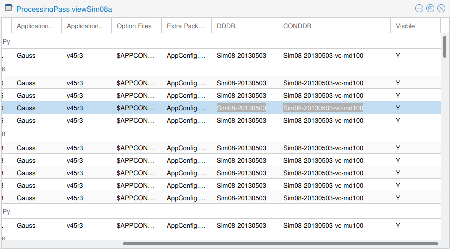

## Split book-keeping files
The `.dst` description files downloaded directly from `Dirac` contains a list with
a large number of files (700 files or more). For example, this file contains 1690 lines:
```
/lhcb/LHCb/Collision12/SEMILEPTONIC.DST/00067251/0000/00067251_00001536_1.Semileptonic.dst
/lhcb/LHCb/Collision12/SEMILEPTONIC.DST/00067251/0000/00067251_00001039_1.Semileptonic.dst
/lhcb/LHCb/Collision12/SEMILEPTONIC.DST/00067251/0000/00067251_00000344_1.Semileptonic.dst
/lhcb/LHCb/Collision12/SEMILEPTONIC.DST/00067251/0000/00067251_00000301_1.Semileptonic.dst
/lhcb/LHCb/Collision12/SEMILEPTONIC.DST/00067251/0000/00067251_00000850_1.Semileptonic.dst
/lhcb/LHCb/Collision12/SEMILEPTONIC.DST/00067251/0000/00067251_00000988_1.Semileptonic.dst
/lhcb/LHCb/Collision12/SEMILEPTONIC.DST/00067251/0000/00067251_00001423_1.Semileptonic.dst
/lhcb/LHCb/Collision12/SEMILEPTONIC.DST/00067251/0000/00067251_00000841_1.Semileptonic.dst
...
/lhcb/LHCb/Collision12/SEMILEPTONIC.DST/00067251/0000/00067251_00001096_1.Semileptonic.dst
```

It is impractical to download every single one of them, as we don't have enough
storage space in `lxplus`, even with `EOS`.

To split, we use `split`, a linux tool that should have been installed by default:
```
split --lines=50 <filename.txt>
```
In this case, the `<filename.txt>` will be sliced for every 50 lines, and the
output filenames will be `x??`.


## Download data files with `lxplus`
To download all dst files listed in a bookkeeping file:
```
lhcb-proxy-init
lb-dirac dirac-dms-get-file -D <target_dir> --File <file_with_list_of_lfns>
```

If you know a `LFN`, instead of a file that contains a list of `LFN`s, you can:
```
lb-dirac dirac-dms-get-file -D <target_dir> -l <lfn>
```


## Query MC DDDB and CONDDB tags

!!! warning
    MagUp and MagDown have different tags. Typically you can replace `mu100`
    with `md100`.

Open **DIRAC**, then for a given MC LFN, say:
```
/MC/2012/11873010/Beam4000GeV-2012-MagDown-Nu2.5-Pythia8/Sim08a/Digi13/Trig0x409f0045/Reco14a/Stripping20Filtered/DSTTAUNU.SAFESTRIPTRIG.DST
```

Expand up to the **`Sim08a`** folder, then right click **More info**. We should see something like this:



Now, the DDDB tags should start with `dddb-`, and CONDDB `sim-`.
