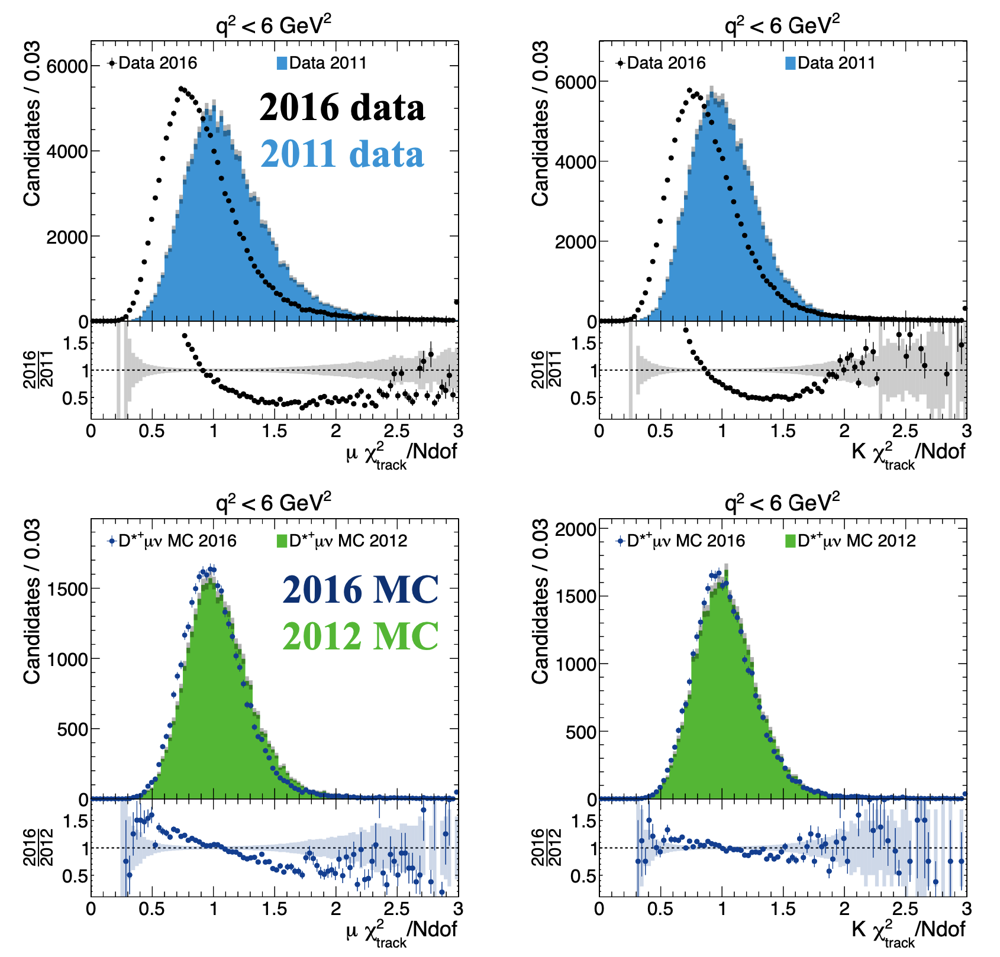

# Track $\chi^2/DOF$ data-MC inconsistency

For the run 1 and 2 data-MC comparison, we observed that for run 1 data, MC and
run 2 MC, their track $\chi^2/DOF$ distributions are all centered around 1, yet
that of run 2 data is centered around 0.75:

Puzzled by this, we asked experts[^1] about this. The answer was:

- The OT drift time was improved so the actual tracking performance is better
    - This is mostly due to better alignment and calibrations.
- However, the OT uncertainties used in $\chi^2$ calculation was **not updated
   for data, and data only**.
    - Now we have something like this:

        | mode | residual | resolution |
        |---|---|---|
        | data | new | old |
        | MC   | new | new |

    - Note that $\chi^2$ here is computed by $\frac{\text{residual}}{\text{resolution}}$.
    - As a result, MC does not agree with data.

!!! note
    - In `DaVinci`, the branch name is `_TRACK_CHI2NDOF`
    - This also affects related variables, like Ghost probability rate (`_TRACK_GhostProb`)
    - The implication of this is still under discussion

[^1]: Gregory Ciezarek and Lucia Grillo
