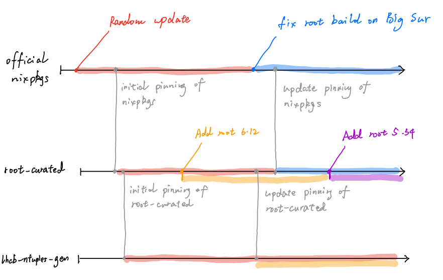

## What is `nix`?

`nix` is a package manager that aims to avoid the *dependency hell* that you some times enter with conventional package
managers such as `rpm` or `pip`. This [*nix-pills*
post](https://nixos.org/guides/nix-pills/why-you-should-give-it-a-try.html) explains `nix` advantages in more detail,
but basically, it stores each package and its version at `/nix/store/hash-name` (eg,
`/nix/store/s4zia7hhqkin1di0f187b79sa2srhv6k-bash-4.2-p45/`). Everything in this store is immutable, and packages are
built against absolute paths whose code never changes. Per *nix-pills*,
> What does all this mean? It means that you could run mysql 5.2 with glibc-2.18, and mysql 5.5 with glibc-2.19.
> You could use your python module with python 2.7 compiled with gcc 4.6 and the same python module with python 3 compiled with gcc 4.8, all in the same system.

For our purposes, we configure the dependencies needed in some of our repos with `flake.nix` files such as [the one in
`lhcb-ntuples-gen`](https://github.com/umd-lhcb/lhcb-ntuples-gen/blob/master/flake.nix). You then type `nix develop`, et
voila, you have all the packages you need (after some compilation if it is the first time you do it).

## `ROOT` in `nix` and our documentation
Importantly, `nix` allows us to run various versions of CERN's `ROOT` simultaneously, which is needed because in some
cases, old code like the `uBDT` classifier relies on ROOT versions too old to be compiled in modern systems.

We set up various `ROOT` versions at [`root-curated`](https://github.com/umd-lhcb/root-curated): 5.34/38, 6.16/00, and
6.24/02. These can then be picked up in the various repos, see
[here](https://github.com/umd-lhcb/histfactory-fitter-demo/blob/639124d61428ceeedde6acb10435811b2295aa4e/flake.nix#L21-L33)
an example. Note that various repos may use the same version of `ROOT`. You will only need to compile it once for all of
them.

The [`README`](https://github.com/umd-lhcb/root-curated/blob/master/README.md) in `root-curated` also provides our basic
`nix` documentation, for instance [**installation in macOS or
linux**](https://github.com/umd-lhcb/root-curated/blob/master/README.md#install-nix-on-macos) or [automatic `nix
develop` with
`direnv`](https://github.com/umd-lhcb/root-curated/blob/master/README.md#automate-nix-develop-by-installing-direnv).

## `nixpkgs`

`nixpkgs` is the main registry that contains all official packages provided by Nix/NixOS project (`nix` is a package in
`nixpkgs`). When you install `nix`, a system-wide version of `nixpkgs` is specified in the installer (let's call it
`nixpkgs-ver_sys`). In the `root-curated` flake, we pin a version of `nixpkgs` (say, `nixpkgs-ver_root_curated`).

In general, `nixpkgs-ver_sys != nixpkgs-ver_root_curated`. This `nixpkgs-ver_root_curated` is only effective in the
`root-curated` project. It is completely isolated from your system.

In `lhcb-ntuples-gen` flake, we pin a version of `root-curated`. We also configure this flake in a way such that we use
the `nixpkgs` pinned in the pinned `root-curated` flake. Denote this `nixpkgs` as `nixpkgs-ver_ntuples_gen` Similarly,
`nixpkgs-ver_ntuples_gen != nixpkgs-ver_root_curated`, unless you manually update `root-curated` pointer in
`lhcb-ntuples-gen`. Another possibility of `nixpkgs-ver_ntuples_gen == nixpkgs-ver_root_curated` is that we don't update
the `nixpkgs` pointer in `root-curated`.

The diagram below gives a visual example of the `nixpkgs` version changing, and only being picked up by `root-curated`
with the pinning changes.

